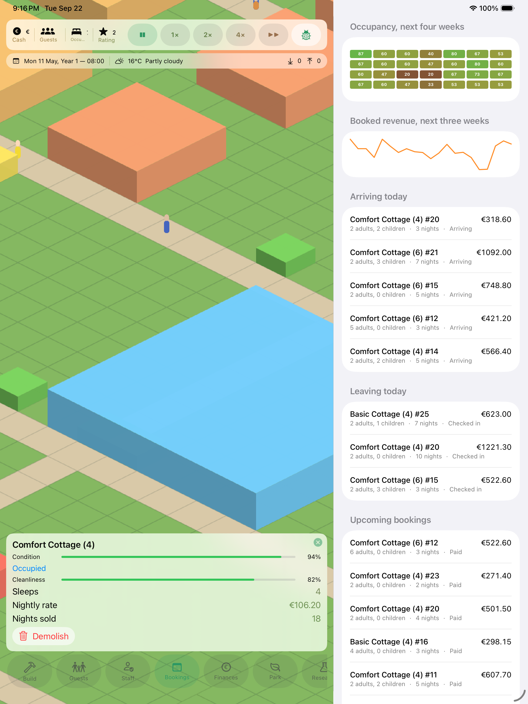

# ParkLife

A management and tycoon game for iPhone and iPad: build and run holiday parks with cottages,
restaurants, shops, swimming pools, activities, staff and thousands of simulated guests.

ParkLife is its own thing. It takes the *genre* of classic park-building games and the *subject*
of holiday-resort management as inspiration, and uses no artwork, names, maps, characters, UI,
sounds or logos from any existing product.



> Real captures of the app running in an iOS simulator, taken by CI on every push — the park in
> them is a simulation that really ran. See
> [`docs/screenshots/README.md`](docs/screenshots/README.md).

---

## What makes it a holiday park, not a theme park

Guests do not wander in for an afternoon. They **book** a cottage weeks ahead, **arrive** on a
Friday, **check in**, **stay several nights**, eat, swim, get bored, get rained on, **check out**
on Monday morning and **write a review** — and that review moves the park's reputation, which
moves demand, which changes what the next booking is worth.

```
BUILD → BOOKING → ARRIVAL → STAY → SPENDING → DEPARTURE → REVIEW → PROFIT
```

That whole loop runs today, headless, and is covered by tests.

## Status

**Phase 0 (architecture) and Phase 1 (playable vertical slice) complete and verified by CI.**
The simulation core builds and its 225 tests pass on Linux; the SwiftUI/SpriteKit app builds on
macOS and runs in a simulator, which is where the screenshots above come from. See
[Honest status](#honest-status) below and [`docs/ROADMAP.md`](docs/ROADMAP.md) for the detail.

| Layer | State |
|---|---|
| `ParkLifeCore` — simulation, economy, pathfinding, persistence | Implemented, ~10,700 lines, 227 tests across 36 suites, green on Linux |
| Content catalog — 31 buildings, 4 path types, 6 group archetypes, 3 maps, 3 scenarios, 12 research projects | Implemented as JSON |
| `App/ParkLife` — SwiftUI + SpriteKit | Implemented; builds on macOS in CI and runs in a simulator |
| Verification — `./Tools/verify.sh`, run locally and by CI | Green: structure, core on Linux, app on macOS, simulator screenshots |

## Getting started

```sh
git clone <this repo>
cd ParkLife

# Simulation core: builds and tests anywhere with a Swift toolchain, including Linux.
swift build
swift test

# The game itself:
open App/ParkLife.xcodeproj    # requires Xcode 16+, iOS 17+ target
```

### Verifying a change

```sh
./Tools/verify.sh          # structure + catalog + core build + core tests
./Tools/verify.sh --app    # …and build the iOS app (needs Xcode)
./Tools/verify.sh --quick  # structure + catalog only, no compiler needed
```

`.github/workflows/ci.yml` runs this same script on Linux and macOS, so CI and a local run mean
exactly the same thing. `verify.sh` runs whatever the machine can run, **names what it skipped**,
and exits non-zero on the first real failure — so a pass never implies more than was checked.
If you want it enforced before every push:

```sh
ln -s ../../Tools/hooks/pre-push .git/hooks/pre-push
```

The Xcode project references the package at the repository root as a local Swift package, so
there is nothing to resolve and no third-party dependency to fetch — ParkLife has **none**.

## Architecture in one paragraph

Simulation and rendering are separate targets, not separate folders. `ParkLifeCore` is a
platform-agnostic Swift library that imports nothing but Foundation: no SwiftUI, no SpriteKit, no
UIKit, no CloudKit. It owns the world and advances it in fixed one-minute ticks. The app layer
receives an immutable `WorldSnapshot` to draw and sends back `GameIntent` values; it cannot mutate
the world even by accident. That boundary is what makes the simulation testable without a
simulator, deterministic from a seed, and safe to save as a whole-world snapshot.

Read more: [`docs/ARCHITECTURE.md`](docs/ARCHITECTURE.md) ·
[`docs/SIMULATION.md`](docs/SIMULATION.md) · [`docs/SAVE_FORMAT.md`](docs/SAVE_FORMAT.md) ·
[ADRs](docs/adr/)

## What is actually simulated

* **Time** — one tick is one simulated minute; paused/1×/2×/4×/max, fixed-step, frame-rate
  independent, with a real calendar including seasons, weekends and school holidays.
* **Demand** — a daily enquiry model driven by season, weekday, school-holiday windows,
  reputation, facility mix and price-versus-perceived-value. Enquiries that cannot be housed or
  will not pay the price are counted as lost, which is the most actionable number in the game.
* **Reservations** — a real booking engine with deposits, cancellations, no-shows and an interval
  availability check that makes double-booking impossible rather than unlikely.
* **Guests** — individuals inside parties, with personality, interests and five need pressures,
  choosing what to do by utility scoring over *measured* inputs: real network distance, live queue
  length, current weather, the party's remaining budget.
* **Thoughts and reviews** — every thought a guest has comes from a measured condition
  ("our cottage is 63 tiles from the pool"), and every star in a review traces back to a
  recorded moment during the stay.
* **Staff** — a task queue with shifts and skill. A party checks out, the cottage goes dirty, a
  housekeeper walks over and cleans it, and only then can the next party check in. With nobody to
  do it, arrivals wait and say so.
* **Economy** — integer cents throughout, daily settlement of wages, utilities, maintenance,
  insurance, interest and tax, with pre-aggregated books so no dashboard ever rescans history.
* **Pathfinding** — flow fields for shared destinations (O(1) per step for any number of guests),
  budgeted A\* for private ones, union-find connectivity so "you can't get there" is answered
  instantly.

## Honest status

The container this repository was developed in has **no Swift toolchain** (swift.org is blocked by
the environment's network policy) and no macOS, so nothing here was ever compiled locally. Every
claim below rests on CI instead, which does have both:

* **The simulation core builds and its tests pass.** `swift build` and `swift test` run on Linux
  against `swift:6.3.3-noble` — 225 tests, including a 45-day vertical slice that exercises the
  whole holiday loop from booking to review. This also proves the core really is Foundation-only:
  it would not compile on Linux otherwise.
* **The app builds and runs.** The macOS job builds the SwiftUI/SpriteKit target with Xcode, and
  the screenshots job installs it on a simulator, warms a park up by 25-40 simulated days and
  captures the screen. The images in `docs/screenshots/` are those captures.
* **Some things only a picture catches.** Three real defects — blank frames, a cash balance
  wrapped one character per line, and an overlay laid out wider than the screen — were invisible
  to all 225 tests and showed up only in the screenshots. They are fixed; the point is that a
  green test suite is not the same as a working screen.
* `Tools/check_sources.py` runs everywhere and does what can be done without a type checker:
  brace/paren balance with a real lexer, `#if`/`#endif` balance, non-exhaustive switches over the
  project's own enums, duplicate top-level declarations, references to types that are declared
  nowhere, and catalog JSON validity. It is itself verified against fixtures that fail on
  purpose, and the project passes it clean.

This is written down rather than glossed over because the alternative — claiming a green build
nobody ran — is worse than the limitation.

## Repository layout

```
Package.swift              SwiftPM: ParkLifeCore + its tests
Sources/ParkLifeCore/      The simulation. Foundation only.
  Support/ World/ Catalog/ Time/ Systems/ Pathfinding/ Build/ Persistence/ Engine/
  Resources/Catalog/*.json The entire content catalog
Tests/ParkLifeCoreTests/   Headless tests: no rendering, no simulator
App/ParkLife.xcodeproj     The iOS app
App/ParkLife/
  App/ Rendering/ UI/      SwiftUI + SpriteKit, consuming snapshots only
docs/                      Architecture, simulation, save format, roadmap, ADRs, screenshots
Tools/                     verify.sh, the source checker, the screenshot mockup generator
```

## Licence and assets

All artwork in the game is generated in code as placeholders (`PlaceholderArt.swift`) and is
original. Art identifiers in the content catalog are deliberately separate from simulation
identifiers, so real sprites can be dropped in later without touching a line of gameplay code.
